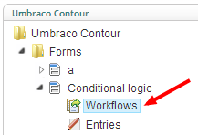
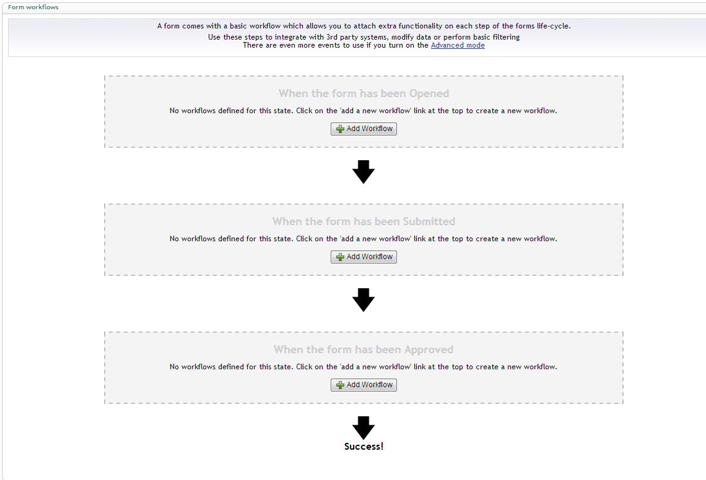
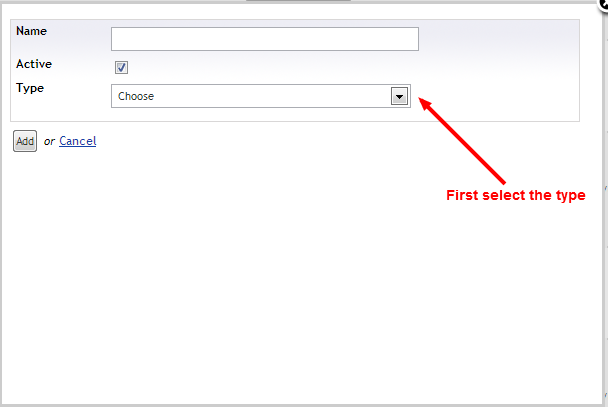
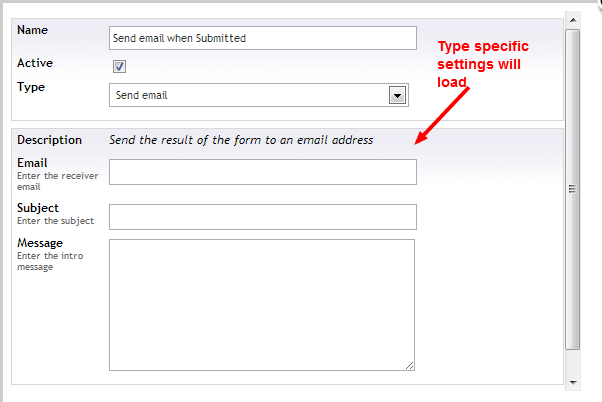
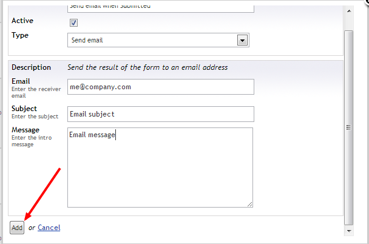

#Attaching workflows
Submitting a Contour form will result in the record data being stored in the database, if you wish to attach extra functionality to your form you can do so by assigning 1 or multiple workflows (like sending an email).

##Adding a workflow

###Navigate to the workflow page for your form
You can either hit the workflow button on the form designer toolbar 

or select the workflows node under your form in the tree

###Select the state to add a new workflow

Once the page is loaded you should see an overview of the different basic record states

- Opened 
- Submitted
- Approved

Typicaly workflows will be added on the submitted state, to start adding hit the 'add workflow' button

A new modal window should open

###Select the type 

A new workflow can be of different types (an overview can be found [below](#Overviewofthedefaultworkflowtypes)). SO first select the type 

###Fill in type specific settings
Once the type has been selected you should see some additional settings (these depend on the type)

Fill in the settings and hit add

###Overview
You should now be back on the workflow page and get an overview of the attached workflows

##Overview of the default workflow types
There are a couple of default workflow types that can be used to extend the functionality of your form, here is an overview:
###Perform filtering
Delete a record if it contains certain values
###Post as Xml
Posts the form as xml to a url
###Post form to url
Posts the form to a url, either as POST or GET
###Save as file
Saves the result of the form as a file

###Save as umbraco document
Saves the form values as an umbraco document node with a specific type
###Send email
Send the result of the form to an email address

###Send xslt transformed email 
Send the result of the form to an email address (full control over the email contents by supplying an xslt file)

